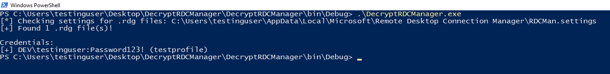
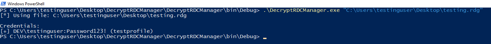

# DecryptRDCManager

`DecryptRDCManager` is a .NET port of [Decrypt-RDCMan.ps1](https://github.com/nettitude/PoshC2/blob/master/resources/modules/Decrypt-RDCMan.ps1) which was written by [Ben Turner](https://twitter.com/benpturner) and [Rich Hicks](https://twitter.com/scriptmonkey_). This tool will decrypt credentials from [Remote Desktop Manager](https://techcommunity.microsoft.com/t5/exchange-team-blog/introducing-remote-desktop-connection-manager-rdcman-2-2/ba-p/592989) by using the functionality from the [RDCMan.DLL](./DLLs/RDCMan.dll) as done [here](https://smsagent.blog/2017/01/26/decrypting-remote-desktop-connection-manager-passwords-with-powershell/).

When a `.rdg` file is identified, the contents will look something like this:

```xml
<?xml version="1.0" encoding="utf-8"?>
<RDCMan programVersion="2.7" schemaVersion="3">
  <file>
    <credentialsProfiles>
      <credentialsProfile inherit="None">
        <profileName scope="Local">testprofile</profileName>
        <userName>DEV\testinguser</userName>
  <password>AQAAANCMnd8BFdERjHoAwE/Cl+sBAAAAlSnFmjEAH0SsyduD82ZosAAAAAACAAAAAAADZgAAwAAAABAAAABimXpySiTYAbe0keAEpZs7AAAAAASAAACgAAAAEAAAACklkBrjv0x63t1+OWBCrCggAAAAvCOw3knvjfpvWFRKJDPI+8ipmOA208hh3EijNOAQG0QUAAAAEX45lKeHqHDty7J9S1/GDw9pcIA=</password>
        <domain>DEV</domain>
      </credentialsProfile>
    </credentialsProfiles>
    <properties>
      <expanded>True</expanded>
      <name>testing</name>
    </properties>
    <server>
      <properties>
        <name>192.168.100.102</name>
      </properties>
      <logonCredentials inherit="None">
        <profileName scope="File">testprofile</profileName>
      </logonCredentials>
    </server>
  </file>
  <connected />
  <favorites />
  <recentlyUsed />
</RDCMan>
```

Credentials can either be stored in `<credentialsProfile>`, or `<logonCredentials>`. During testing, it was found that `<logonCredentials>` would either fail to decrypt, or decrypt to `0123456789`. However, `<credentialsProfile>` was identified to be way more reliable.

## Building

Make sure the `RDCMan.DLL` reference is added into the solution, and then build it. After building the solution, `ILMerge.exe` it:

```
.\ILMerge.exe /out:c:\DecryptRDCManager.exe .\DecryptRDCManager\DecryptRDCManager\bin\Debug\DecryptRDCManager.exe .\DLLs\AxMSTSCLib.dll .\DLLs\MSTSCLib.dll .\DLLs\RDCMan.dll
```

## Usage

A path to a `.rdg` can be passed in, or `DecryptRDCManager` will read the following settings file to determine where any `.rdg` files are:

```
"C:\Users\<username>\AppData\Local\Microsoft\Remote Desktop Connection Manager\RDCMan.settings"
```

Example **without path**:



Example **with path**:


